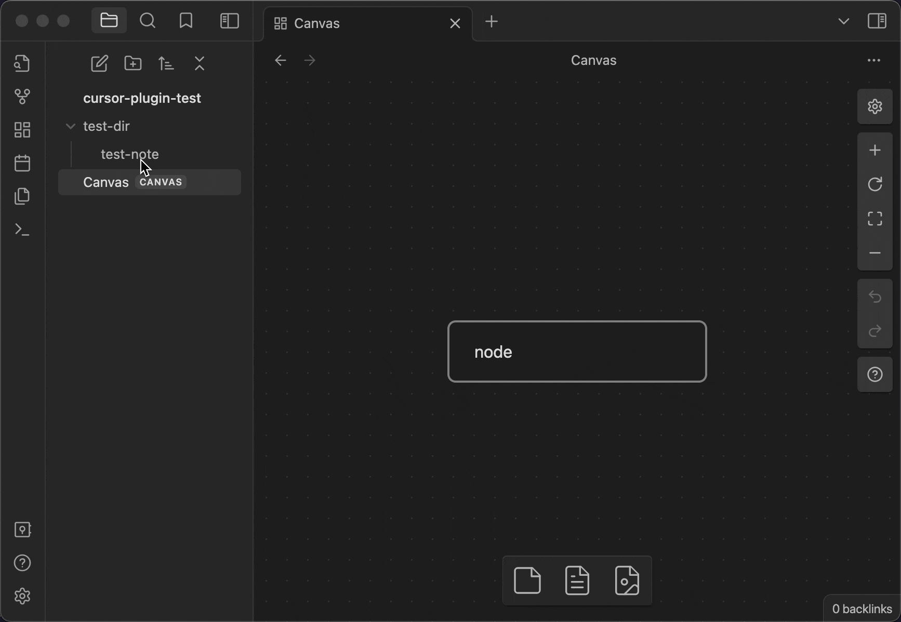

# obsidian-plugin-cursor-goaway

make cursor goaway after open a text file

## before vs after

### before 😑

When the file is opened, the cursor is automatically positioned in the first line and enters the editing mode, which affects the display effect of the first line

### after 😀

## Local Dev

- Clone this repo.
- Make sure your NodeJS is at least v16 (`node --version`).
- `npm i` or `yarn` to install dependencies.
- `npm run dev` to start compilation in watch mode.
